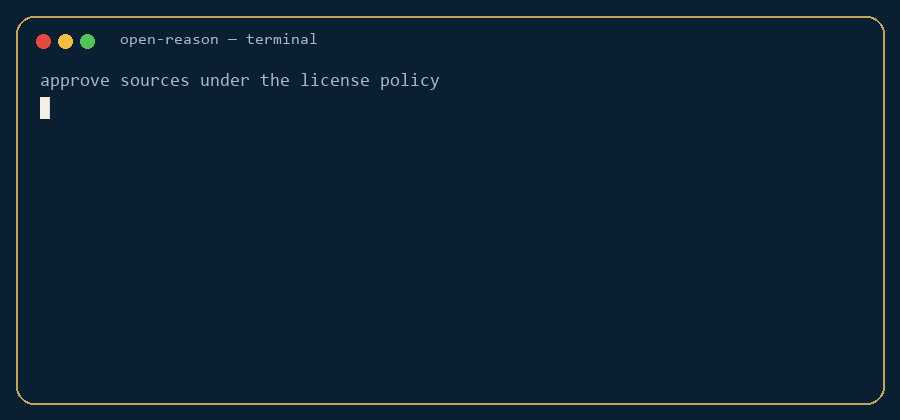
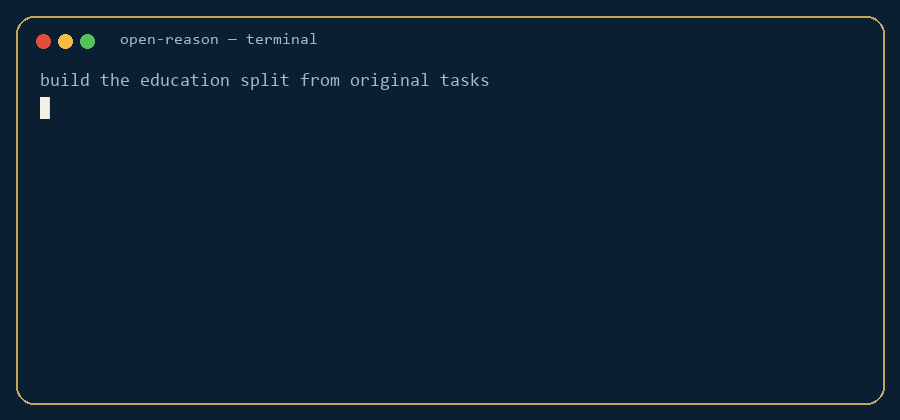
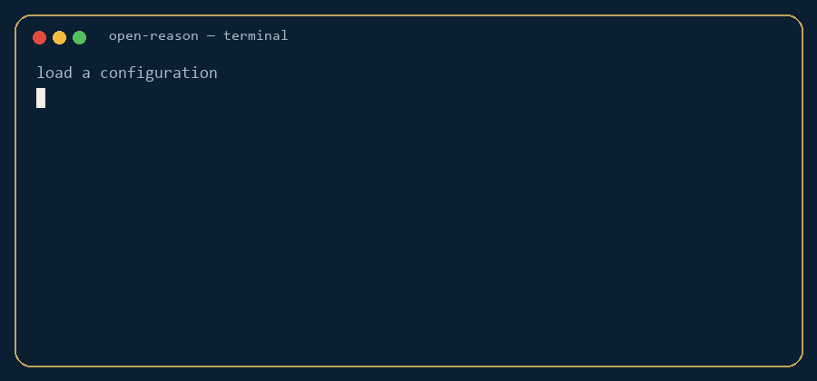

<p align="center">
  
</p>

<h1 align="center">Open Reason</h1>

<p align="center">
  <strong>An open, verified dataset for coding, science, mathematics, and human reasoning.</strong><br>
  Provenance-aware. License-gated. Independently checked. Reproducible.
</p>

<p align="center">
  <a href="LICENSE"></a>
  <a href="CHANGELOG.md"></a>
  <a href="docs/data-sources.md"></a>
  <a href="https://huggingface.co/datasets/theworker02/open-reason"></a>
  <a href="https://huggingface.co/theworker02/open-reason-small"></a>
  <a href="https://huggingface.co/theworker02/open-reason-medium"></a>
  <a href="https://theworker02.github.io/open-reason/"></a>
</p>

<p align="center">
  
</p>

> **Open Reason does not use Reddit as a data source.** Case study: [docs/why-not-reddit.md](docs/why-not-reddit.md) · [project site](https://theworker02.github.io/open-reason/why-not-reddit.html).

## Official links

| What | URL |
| --- | --- |
| **GitHub** (pipeline, tests, samples) | https://github.com/theworker02/open-reason |
| **Dataset** (full shards) | https://huggingface.co/datasets/theworker02/open-reason |
| **Small model** (~1.3M params, CPU) | https://huggingface.co/theworker02/open-reason-small |
| **Medium model** (larger CPU GPT, not 1B) | https://huggingface.co/theworker02/open-reason-medium |
| **Site** | https://theworker02.github.io/open-reason/ |

Full Parquet/JSONL shards are on Hugging Face, not GitHub. Project license is Apache-2.0 only.

```python
from datasets import load_dataset
from transformers import AutoModelForCausalLM, AutoTokenizer

ds = load_dataset("theworker02/open-reason", "all")
tok = AutoTokenizer.from_pretrained("theworker02/open-reason-medium")
model = AutoModelForCausalLM.from_pretrained("theworker02/open-reason-medium")
# or: theworker02/open-reason-small
```

## Changelog

See **[CHANGELOG.md](CHANGELOG.md)** for every release.

| Version | Date | Notes |
| --- | --- | --- |
| **[v1.4.0](CHANGELOG.md#v140--2026-08-18)** | 2026-08-18 | Larger verified corpus; small + medium CPU models |
| **[v1.3.8](CHANGELOG.md#v138--2026-08-18)** | 2026-08-18 | Apache-2.0 only; train-sized corpus; small CPU causal LM |
| **[v1.0.0](CHANGELOG.md#v100--2026-08-18)** | 2026-08-18 | Catalogs in every section, broader original tasks, local 1.0 dataset |
| **[v0.4.0](CHANGELOG.md#v040--2026-08-18)** | 2026-08-18 | Policy engine, coverage generation, training pipeline |
| **[v0.3.0](CHANGELOG.md#v030--2026-08-18)** | 2026-08-18 | Curriculum auto-approve, original source-tagged tasks, README demos |
| [v0.2.0](CHANGELOG.md#v020--2026-08-18) | 2026-08-18 | Source registry, knowledge graph, education / core / verified splits |
| [v0.1.0](CHANGELOG.md#v010--2026-08-18) | 2026-08-18 | Schema, sandbox verification, first seed release |

## Why it exists

Most public “reasoning” corpora are web dumps, unverified generations, or evaluation sets reused as training data. Open Reason is built so every row can answer: Where did this come from? May I use it? Was the answer actually checked?

It is a dataset **and** the pipeline that produces it.

## GitHub vs Hugging Face

- **GitHub** [`theworker02/open-reason`](https://github.com/theworker02/open-reason) is the lab: pipeline, schemas, taxonomy, registry, tests, docs, configs, and small samples. Default branch is `main`. Full shards are **not** in git.
- **Hugging Face dataset** [`theworker02/open-reason`](https://huggingface.co/datasets/theworker02/open-reason) is distribution: Parquet shards and the dataset card.
- **Small CPU model** [`theworker02/open-reason-small`](https://huggingface.co/theworker02/open-reason-small) is a ~1.3M-parameter GPT-2-style causal LM.
- **Medium CPU model** [`theworker02/open-reason-medium`](https://huggingface.co/theworker02/open-reason-medium) is a 13,867,008-parameter GPT-2-style causal LM (CPU, not 1B).
- `open-reason build` writes local `data/release/`. Those `*.parquet` / `*.jsonl` shards are gitignored. A committed sample lives in `data/sample/`.

See [docs/huggingface.md](docs/huggingface.md) and [docs/releases.md](docs/releases.md).

## Quick start

```bash
git clone https://github.com/theworker02/open-reason.git
cd open-reason
pip install -e ".[dev]"
open-reason sources --approve --apply
open-reason build --config all --seed 42 --out data/release
```

Load:

```python
from datasets import load_dataset

coding = load_dataset("theworker02/open-reason", "coding")
math = load_dataset("theworker02/open-reason", "mathematics")
education = load_dataset("theworker02/open-reason", "education")
core = load_dataset("theworker02/open-reason", "core")
```

## How to use it

### 1. Auto-approve sources

Auto-approve is a **license policy**, not a scrape. It enables original Open Reason tasks inspired by a source’s public curriculum or docs. It never copies lectures, never sets `verbatim=true` for NC/SA/unknown licenses, and never enables Reddit.

<p align="center">
  
</p>

```bash
open-reason sources --approve          # dry run
open-reason sources --approve --apply  # write sources/registry.yaml
```

### 2. Generate original examples

<p align="center">
  
</p>

```bash
open-reason generate --domain education
open-reason ingest --source khan-academy   # original tasks, not copied lessons
open-reason ingest --source reddit         # rejected
```

### 3. Load a configuration

<p align="center">
  
</p>

```python
from datasets import load_dataset
ds = load_dataset("theworker02/open-reason", "coding", split="train", streaming=True)
for row in ds.take(3):
    print(row["id"], row["task_type"])
```

## Dataset configurations

```text
coding | reasoning | science | mathematics | human | education | core | verified | all
```

| Config | Contents |
| --- | --- |
| `coding` | Sandbox-tested software tasks (Python, SQL, JavaScript when available) |
| `mathematics` | Symbolic / integer-checked problems |
| `science` | Independently recomputed numerical and conceptual items |
| `reasoning` | Structured planning and constraint problems |
| `human` | Teaching, synthesis, decision support |
| `education` | Curriculum graph + original tasks from auto-approved sources |
| `core` | Quality tiers S and A |
| `verified` | Tier S only (`quality.verified` after a real check) |
| `all` | Union by `id` |

## Auto-approve policy

```text
permissive SPDX + commercial + no share-alike  →  original tasks (verbatim still off until a reviewed crawler)
education / docs with unclear or SA/NC terms   →  original tasks only
Reddit / Quora / prohibited                    →  never
Stack Overflow                                 →  original rewritten seeds only (not verbatim CC BY-SA dumps)
```

`quality.verified` is never set from votes, views, or “accepted answer.”

## Pipeline

```text
source registry
    → license-policy auto-approve
    → original task generation
    → normalize / validate / Reddit block
    → execute or symbolic check
    → deduplicate
    → contamination report
    → statistics + Parquet / JSONL
```

```bash
open-reason sources
open-reason generate --domain programming
open-reason validate data/release --strict
open-reason statistics --config all
open-reason benchmark
```

## Schema

Every example carries knowledge, task, evidence, solution, verification, provenance, educational position, and quality — not only `prompt` + `answer`.

```json
{
  "id": "or-mathematics-synthetic-…",
  "domain": "mathematics",
  "task_type": "algebra",
  "prompt": "…",
  "observations": [],
  "constraints": [],
  "plan": [],
  "solution": "…",
  "answer": "…",
  "verification": {"method": "sympy", "passed": true},
  "provenance": {"source_type": "synthetic", "license_spdx": "Apache-2.0"},
  "quality": {"tier": "S", "verified": true, "evidence_confidence": 0.81},
  "education_level": "high_school",
  "concept_id": "math.algebra"
}
```

JSON Schema: [`schemas/`](schemas/).

## Quality tiers

| Tier | Meaning |
| --- | --- |
| **S** | A check ran and passed |
| **A** | Reviewed / human-authored, not claimed executed |
| **B** | Synthetic, structurally valid |
| **C** | Raw (unused) |

## Licensing

- Project: [Apache 2.0](LICENSE)
- Per-row `provenance.license_spdx` records upstream SPDX (GitHub MIT/BSD/Apache snippets, SO-inspired original rows)
- Share-alike and non-commercial third-party text is not relicensed into this release

## Statistics

<!-- BEGIN_RELEASE_SNAPSHOT -->
Pipeline version **1.4.0**.

| Configuration | Examples | Verified | Human-authored |
| --- | ---: | ---: | ---: |
| coding | 400 | 386 | 0 |
| reasoning | 580 | 580 | 0 |
| science | 527 | 527 | 0 |
| mathematics | 1050 | 1050 | 0 |
| human | 289 | 261 | 28 |
| education | 345 | 111 | 0 |
| core | 3175 | 2899 | 28 |
| verified | 2899 | 2899 | 0 |
| all | 3175 | 2899 | 28 |

Rebuild with `open-reason build --config all --seed 42 --out data/release`.
Full tables: `data/release/statistics.md`.
<!-- END_RELEASE_SNAPSHOT -->

## Limitations

- Quality over scale: this is a foundation, not a web dump
- Auto-approve does **not** download Khan Academy, MIT OCW, MDN, or Stack Overflow
- Verified coding languages are those the sandbox can run
- Teaching items are not executable oracles
- Benchmark denylists cannot be complete

## Documentation

- [Project site](https://theworker02.github.io/open-reason/)
- [Architecture](docs/architecture.md)
- [Data sources](docs/data-sources.md) · [Why not Reddit](docs/why-not-reddit.md)
- [Knowledge graph](docs/knowledge-graph.md)
- [Provenance](docs/provenance.md) · [Licensing](docs/licensing.md) · [Quality](docs/quality.md)
- [Validation](docs/validation.md) · [Verification](docs/verification.md) · [Sandbox](docs/sandbox.md)
- [Contamination](docs/contamination.md) · [Releases](docs/releases.md)
- [Hugging Face](docs/huggingface.md) · [Dataset card](DATA_CARD.md)
- [Evaluation](docs/evaluation.md) · [Training](docs/training.md)
- [Contributing](CONTRIBUTING.md) · [Security](SECURITY.md)

## Citation

```bibtex
@misc{openreason2026,
  title        = {Open Reason: An open, verified dataset for coding, science, mathematics, and human reasoning},
  author       = {Open Reason contributors},
  year         = {2026},
  howpublished = {\url{https://github.com/theworker02/open-reason}},
  note         = {Dataset and pipeline v1.4.0}
}
```

Also see [`CITATION.cff`](CITATION.cff).

**Open. Licensed. Provenanced. Diverse. Verified. Reproducible. Completely free of Reddit.**
